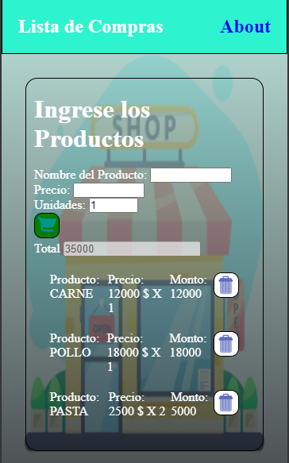

### Hola Bienvenido al Proyecto de Lista de Compras

El sigueinte proyecto se realizo con:

HTML
CSS
 JavaScript

Tomando un poco la idea del to do en esta pagina de Lista de compras manipularemos el DOM mediante Javascript para agregar o eliminar elementos, los cuales tendrán un precio y cantidad para ir sumando o restando en el precio final o el total.

Realice la página para poder ejecutarla en el celular y llevar un registro de los productos que voy tomando cuando voy al supermercado y llevar un control en las cuentas.

## Url

 Ejecutable

## Pantallas

Inicio

Agregando Productos

